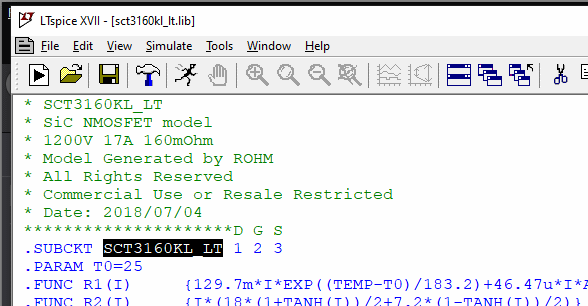
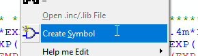
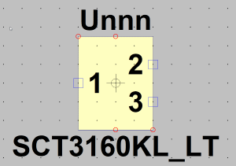
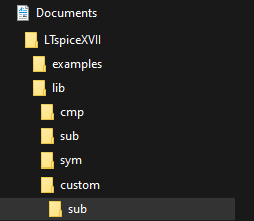
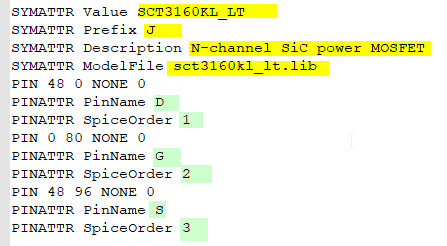
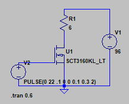
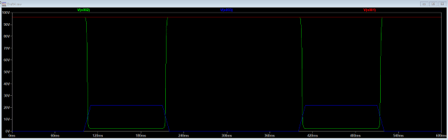

# Create a spice symbol and use a model

Download the spice model for the component.  
Here we are using the sct3160kl_lt.lib.  

Start LTspice and drop the .lib on the LTspice window, the lib will open  
Select the name after .SUBCKT with the mouse  
    
     
Press Right Mouse Button and select item 'create symbol'  

Answer yes to the question from the dialog. A symbol is generated.  

As this symbol is quite ugly for a fet we create a new symbol for it.  
In the location /This PC/Documents/LTspiceXVII/lib/sym/AutoGenerated a file called SCT3160KL_LT.asy is available. 
Rename SCT3160KL_LT.asy to SCT3160KL_LT.asy.old  

Copy the nmos.asy from the location where LTspice is installed C:\Program Files\LTC\LTspiceXVII\lib\sym  
Rename the file to SCT3160KL_LT.asy  
Move the .asy and .lib to a location on the harddisc where the custom library is stored, the .lib must be stored in the folder called sub

Change the following lines in the new SCT3160KL_LT.asy.  
  
The lines marked in yellow must be changed
The lines marked in green must match the data from the lib

Test the component by creating a schematic and running a simmulation  
  
  
